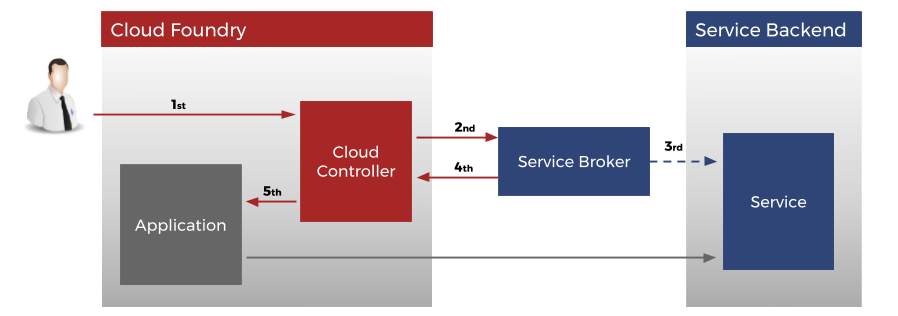

= Cloudfoundry Service-Broker

. link:README.adoc[Getting Started]
. link:README.adoc[Contribution]
. link:docs/requirements.adoc[Requirements]
. Installation
.. link:docs/setup.adoc[Setup]
.. link:docs/deploymentscripts.adoc[Installation & Configuration Scripts]
. link:docs/usage.adoc[Usage]
. link:docs/repositories.adoc[Repositories]
. link:docs/developers.adoc[Developers]
. link:docs/license.adoc[License]

== 1. Getting Started

=== What are Service Brokers?

A Service Broker provides the possibility to extend a platform (in our case it's link:https://www.cloudfoundry.org/[Cloud Foundry]) with services (for example a database) that can be consumed by applications deployed to this platform.

It comes with a catalog of services and service plans, provides service instances, and contains connection details and credentials. It also interprets calls for creating and deleting service instances (for example single databases, dedicated clusters, or just an account on a web application), which means to reserve resources on a service, as well as calls for binding and unbinding services, which means to deliver information to an application for accessing the resource.

image::docs/assets/service_broker_2.png[Service Broker]

For a better understanding of Cloud Foundry Service Brokers also visit https://docs.cloudfoundry.org/services/api.html.

== 2. Contribution

=== Create an Issue

In case you find a bug, don't understand the documentation or have a question about the project you can create an issue. If you don't know how issues work, check out the link:https://guides.github.com/features/issues/[Github issues guide].

When creating an issue you should follow these tips:

- Check if a similar issue *already exists*.
- Describe your problem *as clear as possible*. What was your expected outcome and what happened instead?
- Name your *system details*, for example what operation system or library you are using.
- Paste your *error or logs* in the issue. Make sure to wrap it in three backticks to render it automatically.

=== Pull Request

If you are able to patch a bug or add a feature, you can create a pull request with the code to contribute. But first of make sure you understand the license. Once you created the pull request, the maintainer(s) can check out your code and decide whether or not to pull in your changes.

When creating a pull request you should follow these tips:

- *link:https://guides.github.com/activities/forking/[Fork] the repository* and *clone* it locally. Connect your local repository to the original.
- *Pull changes* as often as possible to stay up to date, so that merge conflicts will be less likely.
- *Create a link:https://guides.github.com/introduction/flow/[branch]* for your changes.
- Run your changes against *existing tests*, or create new ones. 
- Follow the *style of the project*, to make it easier for the maintainer to merge.

If you are asked to make some changes to your request, add more commits and push them to your branch. These changes will automatically go into your existing pull request.

link:docs/requirements.adoc[Next page ->]
