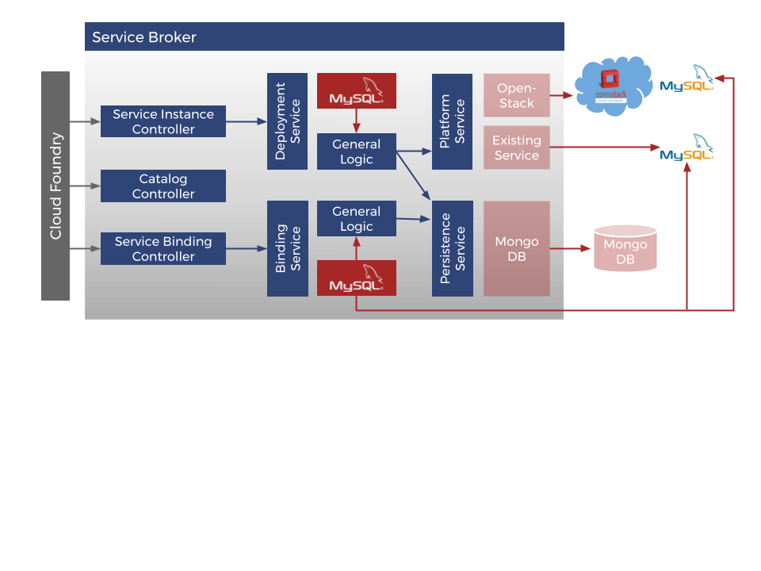

= Cloudfoundry Service-Broker

. link:README.adoc[Getting Started]
. link:docs/requirements.adoc[Requirements]
. Installation
.. link:docs/setup.adoc[Setup]
.. link:docs/deploymentscripts.adoc[Installation & Configuration Scripts]
. link:docs/usage.adoc[Usage]
. link:docs/repositories.adoc[Repositories]
. link:docs/developers.adoc[Developers]
. link:docs/contribution.adoc[Contribution]
. link:docs/releasenotes.adoc[Release Notes]
. link:docs/license.adoc[License]

== 1. Getting Started

NOTE: In order to not provide one overfilled file we decided to seperate the documentations about installation, usage etc. and not to put them all in the README.md-file.

=== What are Service Brokers?

A Service Broker provides the possibility to extend a platform (in our case it's link:https://www.cloudfoundry.org/[Cloud Foundry]) with services (for example a database) that can be consumed by applications deployed to this platform.

image::docs/assets/service_broker_1.png[Service Broker]

It comes with a catalog of services and service plans, provides service instances, and contains connection details and credentials. It also interprets calls for creating and deleting service instances (for example single databases, dedicated clusters, or just an account on a web application), which means to reserve resources on a serivce, as well as calls for binding and unbinding services, which means to deliver information to an application for accessing the resource.

For a better understanding of Cloud Foundry Service Brokers also visit https://docs.cloudfoundry.org/services/api.html.

=== Why use Service Broker?

link:docs/requirements.adoc[Next page ->]
