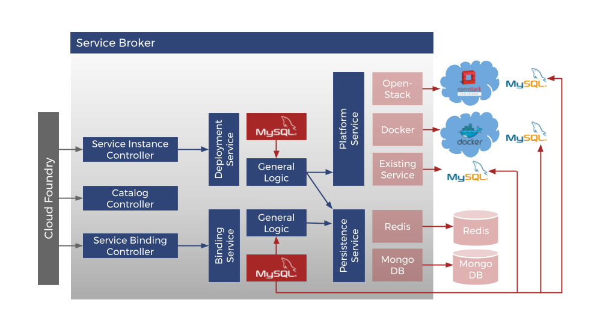

= Cloudfoundry Service-Broker

. link:../README.adoc[Getting Started]
. link:requirements.adoc[Requirements]
. Installation
.. link:setup.adoc[Setup]
.. link:deploymentscripts.adoc[Installation & Configuration Scripts]
. link:usage.adoc[Usage]
. link:repositories.adoc[Repositories]
. link:developers.adoc[Developers]
. link:contribution.adoc[Contribution]
. link:releasenotes.adoc[Release Notes]
. link:license.adoc[License]

== 5. Repositories

=== 5.1 Example Service Broker

*evoila/cf-service-broker-example*

https://github.com/evoila/cf-service-broker-example

An empty Cloud Foundry Service Broker missing concrete implementation of a distinct service. Supports deployment to OpenStack and Docker. Uses Redis Database for management. Configuration files and deployment scripts must be added. Concrete Service logic and binding logic has to be added.

=== 5.2 Deployment, Infrastructure, etc.

*evoila/cf-service-broker-core*

https://github.com/evoila/cf-service-broker-core

This project provides core functionalities for Cloud Foundry Service Broker. It needs deployment services and a persistence service (see https://github.com/evoila/cf-service-broker-deployment and https://github.com/evoila/cf-service-broker-persistence) as well as a concrete implementation of service binding routines for a concrete service (for examples see https://github.com/evoila/cf-service-broker-example and https://github.com/evoila/cf-service-broker-elasticsearch).

Everything *blue* in the following picture is part of the core project:

*evoila/cf-service-broker-persistence*

https://github.com/evoila/cf-service-broker-persistence

Implements the cf-service-broker (see https://github.com/evoila/cf-service-broker) persistence interface with services using Redis. So the management data and inner status of the service broker can be kept in a Redis database.

*evoila/cf-service-broker-deployment*

https://github.com/evoila/cf-service-broker-deployment

This project provides support for deployment of service instances via Cloud Foundry Service Broker (see https://github.com/evoila/cf-service-broker) as Docker Containers onto a Docker Swarm cluster or as Virtual Machines onto OpenStack via Heat Scripts

*evoila/cf-service-broker-infrastructure*

https://github.com/evoila/cf-service-broker-infrastructure

This project provides infrastructure services (like cloud configuration) for Cloud Foundry Service Broker (see https://github.com/evoila/cf-service-broker)

=== 5.3 Services

*evoila/cf-service-broker-mongodb*

https://github.com/evoila/cf-service-broker-mongodb

Cloud Foundry Service Broker providing MongoDB Service Instances. Supports deployment to OpenStack and Docker. *Uses Redis Database* for management. Configuration files and deployment scripts must be added.

*evoila/cf-service-broker-mysql*

https://github.com/evoila/cf-service-broker-mysql

Cloud Foundry Service Broker providing MySQL (MariaDB) Service Instances. Supports deployment to OpenStack and Docker. *Uses Redis Database* for management. Configuration files and deployment scripts must be added.

*evoila/cf-service-broker-postgresql*

https://github.com/evoila/cf-service-broker-postgresql

Cloud Foundry Service Broker providing PostgreSQL Service Instances. Supports deployment to OpenStack and Docker. *Uses Redis Database* for management. Configuration files and deployment scripts must be added.

*evoila/cf-service-broker-rabbitmq*

https://github.com/evoila/cf-service-broker-rabbitmq

Cloud Foundry Service Broker providing RabbitMQ Service Instances. Supports deployment to OpenStack and Docker. *Uses Redis Database* for management. Configuration files and deployment scripts must be added.

NOTE: The following service brokers are implemented but will not be maintained anymore!

*evoila/cf-service-broker-elasticsearch*

https://github.com/evoila/cf-service-broker-elasticsearch

Cloud Foundry Service Broker providing Elasticsearch Service Instances. Supports deployment to OpenStack and Docker. *Uses Redis Database* for management. Configuration files and deployment scripts must be added.

*evoila/cf-service-broker-redis*

https://github.com/evoila/cf-service-broker-redis

Cloud Foundry Service Broker providing Redis Service Instances. Supports deployment to OpenStack and Docker. *Uses Redis Database* for management. Configuration files and deployment scripts must be added.

*evoila/cf-service-broker-logstash*

https://github.com/evoila/cf-service-broker-logstash

Cloud Foundry Service Broker providing Logstash Service Instances. Supports deployment to OpenStack and Docker. *Uses Redis Database* for management. Configuration files and deployment scripts must be added.

link:developers.adoc[Next page ->]