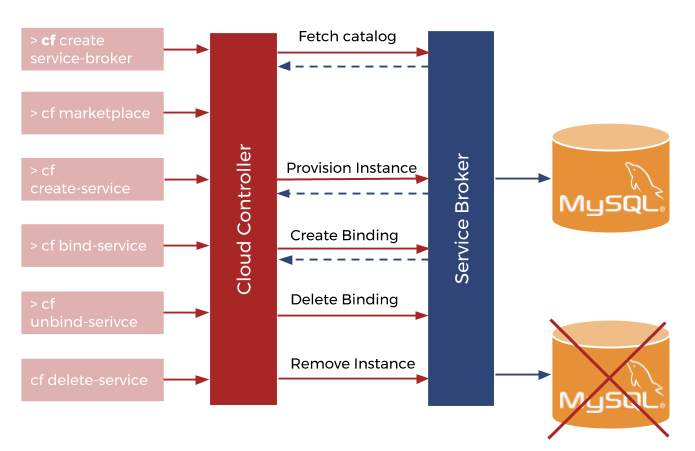

= Cloudfoundry Service-Broker

. link:../README.adoc[Getting Started]
. link:requirements.adoc[Requirements]
. Installation
.. link:setup.adoc[Setup]
.. link:deploymentscripts.adoc[Installation & Configuration Scripts]
. link:usage.adoc[Usage]
. link:repositories.adoc[Repositories]
. link:developers.adoc[Developers]
. link:contribution.adoc[Contribution]
. link:releasenotes.adoc[Release Notes]
. link:license.adoc[License]

== 4. Usage

Before working with Service Brokers you have to clone a couple of repositories:

1. https://github.com/evoila/cf-service-broker-core
2. https://github.com/evoila/cf-service-broker-deployment
3. https://github.com/evoila/cf-service-broker-persistence

For all these use the following step for step guide:

1. Change the location to the directory you want to clone the repository to by running `cd <path>`
2. Clone the repository with `git clone <link>`
3. Run `mvn install` in the respective directories

To work with Service Brokers you have to login your Cloud Foundry CLI to your Cloud Foundry Environment first (if you haven't done this already):

`cf login -u <user> -a <url_of_api_endpoint> -p <password> -o <organization> -s <space>`

Let's assume you already pushed your application as described in the "Setup" documentation.

The following picture shows the basic commands you need to work with a Service Broker and how the Cloud Controller communicates with the Service Broker when using these commands.

=== Creating Service Brokers

After pushing the application you can now create a Service Broker: +
`cf create-service-broker <service_broker_name> <username> <password> <url_of_application>`

You can get the username and password from your application.yml, and the url of the application by simply using: +
`cf apps`

This will show you all provided applications, their status and the url.

NOTE: The service brokers you create are private by default and not immediately availabe to end users. To make them available run: +
`cf enable-service-access <service_broker_name>`

You can get a list of all your services by using +
`cf marketplace`

For more informations also see link:https://docs.cloudfoundry.org/services/managing-service-brokers.html[Managing Service Brokers]

=== Creating and Deleting Service Instance

When you successfully created a service broker, you can go on with creating service instances. Search for the service broker you want to create an instance of and run: +
`cf create-service <service_broker_name> <plan> <service_instance_name>`

The command for deleting a service instance is nearly equivalent to creating: +
`cf delete-service <service_name>`

A list of all services instances can be shown using: +
`cf services`

For more informations also see link:https://docs.cloudfoundry.org/devguide/services/managing-services.html#create[Creating Service Instances]

=== Bind and Unbind services

After creating service instances you can now bind other services to your service instance. Simply run: + 
`cf bind-service <name_of_service_to_bind> <service_instance_name>`

Again the unbind command is pretty much the same: +
`cf unbind-service <name_of_service_to_unbind> <service_instance_name>`

For more informations also see link:https://docs.cloudfoundry.org/devguide/services/managing-services.html#bind[Bind and Unbind a Service Instance]

link:repositories.adoc[Next page ->]